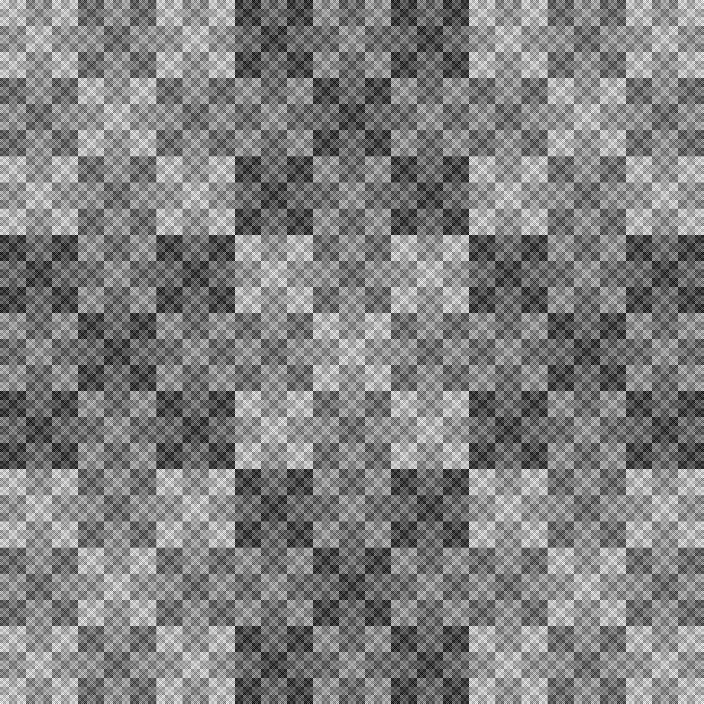
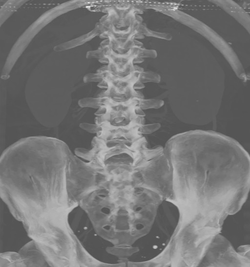

BOLT View
=========

> Easy solution for fast image oriented computations, without losing control.

## What is BoltView?

BoltView is a C++ template library for parallel image processing on GPU and CPU. 
It provides basic datastructures for image storage and manipulation and meta-algorithms for construction of higher level image processing algorithms.

Main goals are:
* Zero-overhead image processing abstractions
* Provide tools covering most frequently occuring patterns in image processing
* Absolute control over resources (no behind the curtain allocations)
* Provide reasonable default execution patterns for algorithm execution on GPU 
* Hide CUDA API complexities, but still provide access to the low level facilities.
* Provide tools usable in both host and device code

The key datastructure concepts are *image* and *image view* whose responsiblities are resource lifetime management resp. image data access.

### Quick start

Instead of long introduction, you can check a following snipped where you can see the basic coding style present
in code using the BoltView library. The main idea lies in using of two concepts: images and views. 
Images manage the resources - memory of different kinds (host, device, unified, texture). 
Views provide access to image data and in most cases only views are passed as input/output parameters to BoltView algorithms.

```c++
// Allocate 200x200 float image in RAM
bolt::HostImage<float, 2> host_image(200, 200);
// Allocate 200x200 float image on GPU
bolt::DeviceImage<float, 2> device_image(host_image.size());

// The algorithm will take an image view and execute lambda function 
// for each pixel in the input image view.
// Since the image view is for the device image the algorithm will be executed on GPU.
// Two parameters passed to lamda are reference to current pixel value and 2D pixel index.
bolt::forEachPosition(
		view(device_image),
		/*lambda that can be executed on both host and device*/
		[](auto &value, auto position) BOLT_DECL_HYBRID  {
			float distance = norm(position - Int2(100, 100));
			if (distance == 0) {
				value = 1.0f;
			} else {
				value = sin(distance) / distance;
			}
		}
// get data from GPU to RAM
bolt::copy(constView(device_image), view(host_image));
```


## How it differs from ___?

There are several libraries that focus on similar tasks. BoltView does not try mimic any of 
these other tools as its goal is different and provides utilities not present in the other projects.
We will list some of these projects here with short comparison and advantage/disadvantage listings.

### [Thrust](https://thrust.github.io/)

STL like library for data processing on GPU. It is distributed together with CUDA SDK.
BoltView uses provides tools for interoperabilty with the Thrust library and also uses it internally.

Pros:
* High level and efficient API

Cons:
* Covers only 1D datastructures
* Does not directly support unified memory

### [ArrayFire](https://arrayfire.com/)

Pros:
* Easy to use - high level API
* Available also for other parallelization technologies (CUDA, OpenCL)
* Large set of algorithms ready to use

Cons:
* Hard to access the low level facilities

### [GIL](https://www.boost.org/doc/libs/1_68_0/libs/gil/doc/html/index.html)

GIL served as a primary inspiration for the choice of the basic image and image view concepts. 

Pros:
* Clean API

Cons:
* Focuses mainly on 2D images
* Supports algorithm execution only on the CPU

## Examples

Here you can check an overview of basic examples provided with the BoltView library. 
Each tries to present a simple usage pattern for the concepts used.

### [Fractals](examples/fractal/doc/fractals.md)

<p float="left" align="center">


</p>

### [Procedural Views](examples/procedural/doc/procedural.md)

<p float="left" align="center">

</p>

### [Edge Detector](examples/edge_detection/doc/edge_detection.md)

<p float="left" align="center">


</p>

### [Maximum Intensity Projection](examples/mip/doc/mip.md)

<p float="left" align="center">


</p>
<p float="left" align="center">


</p>

### [Volume Rendering](examples/volume_rendering/doc/volume_rendering.md)

<p float="left" align="center">


</p>

### [Wiener Filtering](examples/wiener/doc/wiener.md)

<p float="left" align="center">


</p>

### [Richardson-Lucy Deconvolution](examples/rl_deconvolution/doc/rl_deconvolution.md)

<p float="left" align="center">


</p>

## License

For non-commercial use, the library is available under the [AGLPL](https://www.gnu.org/licenses/agpl-3.0.en.html) license.
For commercial use, please contact us at *boltview*@*eyen.se* for licesing options.

## Installation and Usage

The library is header only, so its usage in your project should be quite straightforward.
You have several options:

 * Download an install package from the [release page](https://github.com/eyense/boltview/releases) - this will put the headers in the system `include` dir and cmake config files into system `share` dir.
 * Download the sources or clone the repository and do following:
 	```bash
	cd <boltview_root_dir>
	mkdir build
	cd build
	cmake .. -DCMAKE_INSTALL_PREFIX=<your_preffered_install_directory>
	make -j<choose number of processes> #this will compile the unit tests
	make install
	```
BoltView has several dependencies:
 * [CUDA](https://developer.nvidia.com/cuda-zone)
 * [Boost](https://www.boost.org/)
 * [CMake](https://cmake.org/)
 * [Threading Building Blocks (TBB)](https://github.com/oneapi-src/oneTBB) - optional
	
Minimal `CMakeLists.txt` for your project can look like this:
```
cmake_minimum_required(VERSION 3.10 FATAL_ERROR)

project(MyProject LANGUAGES CXX CUDA)

find_package(BoltView REQUIRED)
find_package(Boost 1.53.0 COMPONENTS system filesystem program_options REQUIRED)

add_executable(maypp main.cu)
target_compile_features(maypp INTERFACE cxx_std_14)
target_link_libraries(maypp Boost::program_options Boost::filesystem BoltView::bolt)
```


## Documentation

[Doxygen documentation](https://eyense.github.io/boltview/index.html)

## Contact

> *boltview*@*eyen.se*

