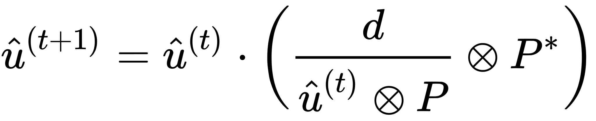

# Richardson-Lucy Deconvolution {#rl_deconvolution}


<p float="left" align="center">


</p>

We will show another deconvolution algorithm, which can be used for image restoration, this time all computations will be done in spatial domain, so we will not be needing the Fourier transformation. 

The important assumptions are that the image was corrupted by *point spread function (PSF)* and additive white noise noise.

Standard Richardson-Lucy deconvolution algorithm is not a blind deconvolution algorithm, so we need to know in advance the point spread function, which blurred the input image.

<p float="left" align="center">

</p>

We prepare the PSF and its flipped version on GPU, so we can use them later:

```c++
DynamicDeviceKernel<float, 2> psf(host_psf);
DynamicDeviceKernel<float, 2> psf_hat(flipConvolutionKernel(host_psf));
```

RL-deconvolution is an iterative algorithm. In our example we will run it for fixed amount of step, but in a real application a little more advanced stopping criterion should be devised and the iteration limit should be present only as a fallback to prevent extremely long computations.

Equation for single step of RL-deconvolution can be seen in following equation, where `d` is the observed corrupted image and `P` is the point spread function. Convolutions with PSF and its flipped version are computed over the whole domain, arithmetic operations (multiplications, divisions) are computed per pixel.

<p float="left" align="center">

</p>

For the implementation we will prepare images on GPU in which we will store the input, current estimate and additional images to store the temporary results.

```c++
DeviceImage<float, 2> d_image(im.size());
DeviceImage<float, 2> estimate(im.size());
DeviceImage<float, 2> tmp(im.size());
DeviceImage<float, 2> tmp2(im.size());
copy(im, view(d_image));
copy(constView(d_image), view(estimate));
```

Actual implementation of the equation is pretty straight forward.

```c++
for (int i = 0; i < kIterationCount; ++i) {
	convolution(constView(estimate), view(tmp), psf);
	copy(constView(d_image) / constView(tmp), view(tmp));
	convolution(constView(tmp), view(tmp2), psf_hat);
	copy(constView(tmp2) * constView(estimate), view(estimate));
}
```

The `convolution()` function does a straight forward convolution of input image view (first parameter) and convolution kernel (third parameter) the result is stored in writable image view (second parameter). Multiplication and deletion construct a wrapper image view, which implements a lazy evaluation - the actual pixel values are computed on demand, such as the copy function in this example.


