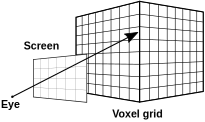

# Volume Rendering {#volume_rendering}


<p float="left" align="center">


</p>

In this example we will show how to implement simple volume renderer based on ray-casting. The goal of this excercise is to show how to employ GPU texture units by storing data in 3D texture image together with complex functor being passed to `forEachPosition()` algorithm.

The first step after data load into the 3D host image is creation of the 3D texture image and transfering the data to the texture.

```c++
Image<float, 3> input_image(size);
// load ...

TextureImage<float, 3> tex_image(input_image.size());
copy(constView(input_image), view(tex_image));
```

`TextureImage<>` template have a third template parameter, which specify texture format details - interpolation type, border handling, etc. For now we will use it with default settings, that means trilinear interpolation, border set to zero and data access coordinates are in <0, size) range (not normalized (0,1)).


<p float="left" align="center">

</p>

Now that we have the data on the GPU we need to think of parallelization strategy. By simple observation we can deduce that computations of output pixels are independent of each other. So we prepare an image as our render target and execute the ray traversal algorithm.
We use `forEachPosition()` algorithm, because have to know where the pixel lies in the output buffer to properly compute the ray direction. For correct ray direction computation we need to specify the *camera* setup. We have to specify the camera (eye) position and a way to specify its local ortonormal coordinate base. We do it by providing a position of a point in space where the camera looks (we use center of our dataset) and up direction (third basis vector can be computed by cross product), we also need to specify the *field of view* of our camera.

```c++
struct Camera {
	Float3 lookat;
	Float3 eye;
	Float3 up;
	float fov = 50.0f;
};
```

Actual rendering procedure would than look like this:
```c++
UnifiedImage<RGBAf, 2> render(output_size);

forEachPosition(
	view(render),
	RayTraversal<TView>(image, render.size(), camera));
```

The `RayTraversal` functor constructor takes a view for our volumetric data, screen size and camera setup. Voxel values in our CT test data represent absorption of the X-ray beam. We can thus simulate classic X-ray imaging just by proper mapping of these densities onto (0.0, 1.0) alpha channel as can be seen in teh following image.

<p float="left" align="center">

</p>

More interesting images can be rendered by providing some mapping between scalar values and color with alpha channel. This is usually done via so call *tranfer functions*, which provides such mapping. We can load sample transfer function for our dataset - it just table of value/RGBA pairs.
We can store it in simple buffer and pass it also to the `RayTraversal` functor:

```c++
forEachPosition(
	view(render),
	RayTraversal<TView, TTransferFunc>(image, tf, render.size(), camera));
```
`RayTraversal` functor needs to compute a ray direction and scale it to reflect the sampling rate. It then proceeds and tranverses the ray. For each sample it reads an interpolated value from the rendered volume (texture), maps the value via 1D transfer function into RGBA value and blends it with the intermediate ray color (this approach is called front-to-back rendering).

```c++
template<typename TView, typename TTransFunction>
struct RayTraversal {
	// constructor ...
	// members ...

	BOLT_DECL_DEVICE
	Float3 computeStep(Int2 coords) const {
		Float2 plane_pos = coords - (0.5f * resolution_);
		Float3 pos = plane_center_ + plane_pos[0] * x_step_ + plane_pos[1] * y_step_;
		return normalize(pos - eye_);
	}

	BOLT_DECL_DEVICE
	void operator()(RGBAf &color, Int2 coords) const {
		Float3 step = step_size_ * computeStep(coords);
		Float3 current_position = eye_ + 800*step;
		RGBAf res;
		for (int i = 0; i < kSampleCount; ++i) {
			auto sample = volume_.access(current_position);
			RGBAf color = tf_[round(sample)];

			res = frontToBackBlend(res, color, step_size_);
			current_position += step;
		}
		color = res;
	}
};
```

There are lots of possible improvements to this method, which can influence quality and rendering speed like antialiasing, early ray traversal termination, ...

But we will do here just one improvement to get nicer output. We will add a little bit of shading to help emphasize the overal structure of the objects in the volume. We need to compute a normal vector. If we consider an isosurface in 3D data then its noraml direction is aligned with the local gradient. So we will estimate the normal direction by computing finite differences in all 3 dimensions. Since we should already have the central value, we will pass it as an argument to prevent unnecessary texture read.

```c++
template<typename TView>
BOLT_DECL_DEVICE
Float3 computeGradient(TView volume, float value, Float3 current_position, float epsilon) {
	return {
		(value - volume.access(current_position - Float3(epsilon, 0.0f, 0.0f))) / epsilon,
		(value - volume.access(current_position - Float3(0.0f, epsilon, 0.0f))) / epsilon,
		(value - volume.access(current_position - Float3(0.0f, 0.0f, epsilon))) / epsilon
	};
}
```

Updated functor will look like this. Where shading is applied by modulating sample color, based on light position, chosen material properties, view direction and normal direction.

```c++
BOLT_DECL_DEVICE
void operator()(RGBAf &color, Int2 coords) const {
	Float3 step = step_size_ * computeStep(coords);
	Float3 current_position = eye_ + 800*step;
	RGBAf res;
	for (int i = 0; i < kSampleCount; ++i) {
		auto sample = volume_.access(current_position);
		auto gradient = computeGradient(volume_, sample, current_position, kGradientEpsilon);
		RGBAf color = tf_[round(sample)];
		color = doShading(
			current_position,
			color,
			light_,
			material_,
			eye_,
			gradient);

		res = frontToBackBlend(res, color, step_size_);
		current_position += step;
	}
	color = res;
}
```

You can see sample outputs from the render at the top of the page. 

	* CT scan of human abdomen - you can clearly identify pelvis, kidneys, liver, ...
	* CT scan of stag beetle

